<div align="center">

```
  /$$$$$$              /$$     /$$                                         /$$   /$$                                              
 /$$__  $$            | $$    |__/                                        |__/  | $$                                              
| $$  \ $$ /$$$$$$$  /$$$$$$   /$$  /$$$$$$   /$$$$$$  /$$$$$$  /$$    /$$ /$$ /$$$$$$   /$$   /$$                                
| $$$$$$$$| $$__  $$|_  $$_/  | $$ /$$__  $$ /$$__  $$|____  $$|  $$  /$$/| $$|_  $$_/  | $$  | $$                                
| $$__  $$| $$  \ $$  | $$    | $$| $$  \ $$| $$  \__/ /$$$$$$$ \  $$/$$/ | $$  | $$    | $$  | $$                                
| $$  | $$| $$  | $$  | $$ /$$| $$| $$  | $$| $$      /$$__  $$  \  $$$/  | $$  | $$ /$$| $$  | $$                                
| $$  | $$| $$  | $$  |  $$$$/| $$|  $$$$$$$| $$     |  $$$$$$$   \  $/   | $$  |  $$$$/|  $$$$$$$                                
|__/  |__/|__/  |__/   \___/  |__/ \____  $$|__/      \_______/    \_/    |__/   \___/   \____  $$                                
                                   /$$  \ $$                                             /$$  | $$                                
                                  |  $$$$$$/                                            |  $$$$$$/                                
                                   \______/                                              \______/                                 
                                                                   /$$$$$$$                                      /$$              
                                                                  | $$__  $$                                    | $$              
                                                                  | $$  \ $$  /$$$$$$  /$$$$$$/$$$$   /$$$$$$  /$$$$$$    /$$$$$$ 
                                                                  | $$$$$$$/ /$$__  $$| $$_  $$_  $$ /$$__  $$|_  $$_/   /$$__  $$
                                                                  | $$__  $$| $$$$$$$$| $$ \ $$ \ $$| $$  \ $$  | $$    | $$$$$$$$
                                                                  | $$  \ $$| $$_____/| $$ | $$ | $$| $$  | $$  | $$ /$$| $$_____/
                                                                  | $$  | $$|  $$$$$$$| $$ | $$ | $$|  $$$$$$/  |  $$$$/|  $$$$$$$
                                                                  |__/  |__/ \_______/|__/ |__/ |__/ \______/    \___/   \_______/
```

### **The Vibecoder's Best Friend**
*Control your PC and AI agent from your phone with zero friction.*

[](https://pypi.org/project/antigravity-remote/)
[](https://opensource.org/licenses/MIT)
[](https://t.me/antigravityrcbot)
[](https://www.python.org/downloads/)
[](https://antigravity-remote.onrender.com/)

[**🚀 Quick Start**](#-quick-start) | [**📺 Live Stream**](#-real-time-streaming) | [**💬 Two-Way Chat**](#-two-way-chat) | [**🛠️ Commands**](#-command-reference)

---
</div>

## 🌟 Overview

**Antigravity Remote** is a powerful bridge between your mobile device and your PC's AI assistant. Whether you're away from your desk or just want to "vibecode" from the couch, it provides a premium, low-latency interface to monitor and control your autonomous agent.

No more running back to your desk to click "Accept". Now, your agent's eyes and ears are in your pocket.

---

## ✨ Features

- 📺 **Real-Time Streaming** - High-speed WebSocket screen view (10+ FPS) directly in your mobile browser.
- 💬 **Two-Way AI Chat** - Send instructions and receive rich AI responses formatted for Telegram.
- 📸 **Smart Screenshots** - Instant visual snapshots with automated action buttons.
- 📋 **Live Code Diffs** - Preview pending file changes before you approve them.
- ↩️ **Universal Undo** - One-tap revert for the last $N$ changes made by your agent.
- ⏰ **Task Scheduling** - Queue commands to run at specific times (e.g., "Run build at 9:00 AM").
- 🐕 **AI Watchdog** - Smart notifications that alert you only when the AI needs your attention.
- 🎮 **Bidirectional Control** - Use Telegram buttons OR the Browser Stream UI to control your PC.

---

## 🚀 Quick Start

### 1. Installation
Get the lightweight agent on your PC:
```bash
pip install antigravity-remote
```

### 2. Connect
Link your PC to the Telegram bot in seconds:
```bash
antigravity-remote --register
```
*Follow the on-screen instructions to get your ID and Auth Token from [@antigravityrcbot](https://t.me/antigravityrcbot).*

### 3. Run
Start the engine:
```bash
antigravity-remote
```

---

## 📺 Real-Time Streaming

Experience **0.1s latency** screen monitoring. Built on custom WebSockets, the stream window provides a premium "Mission Control" interface.

1. Send `/stream` in Telegram.
2. Open the unique link provided.
3. Use the **integrated controls** (Accept, Reject, Scroll, Screenshot) directly from the browser!

---

## 💬 Two-Way Chat

When your AI assistant generates a response, it is automatically captured and relayed to your phone. 

*   **Capture**: Scans the clipboard and terminal for AI output.
*   **Format**: Clean markdown rendering in Telegram.
*   **Action**: Approve or deny the response immediately using inline buttons.
*   **Voice**: Use `/tts` to have the AI response read aloud through your phone.

---

## 🛠️ Command Reference

### 🎮 Live PC Control
| Command | Action |
|---------|--------|
| `/stream` | Start premium WebSocket live stream |
| `/ss` | Take a high-quality snapshot of the current screen |
| `/scroll up/down` | Scroll the active window content |
| `/accept` / `/reject` | Instant approval/denial of pending AI actions |

### 🧠 AI & Code Management
| Command | Action |
|---------|--------|
| `[Any Text]` | Relay instructions directly to your local AI chat |
| `/diff` | Render a beautiful diff of pending code changes |
| `/undo N` | Backtrack $N$ steps (default: 1) |
| `/tts` | Read the last AI response aloud (Text-to-Speech) |

### ⚙️ Automation & Safety
| Command | Action |
|---------|--------|
| `/schedule HH:MM cmd`| Execute a specific command at the scheduled time |
| `/watchdog on/off` | Toggles alerts for when the AI is stuck or waiting |
| `/pause` / `/resume` | Temporarily halt or restart the remote agent |
| `/status` | View connection heartbeat and agent health |

---

## 🏗️ Architecture

```mermaid
sequenceDiagram
    participant User as 📱 Telegram/Browser
    participant Server as ☁️ Render Server
    participant Agent as 💻 Local Agent
    participant PC as 🤖 Local AI (Antigravity)

    User->>Server: Send "/ss" (Screenshot)
    Server->>Agent: Relay Command (WS)
    Agent-->>PC: Capture Screen Buffer
    Agent->>Server: Upload Image (WS)
    Server->>User: Display Screenshot
    PC->>Agent: Captures AI Response
    Agent->>Server: Relay AI Message
    Server->>User: Bot Message: "Pending Approval"
```



---

## 🤝 Contributing

We welcome "vibecoders" of all levels!
1. Fork the [repo](https://github.com/sashimashi51erg/Antigravity-Remote).
2. Create your feature branch.
3. Submit a PR.

*Note: Security is paramount. Never commit your `secrets.py` or `.env` files.*

---

## 📄 License

Distributed under the **MIT License**. See `LICENSE` for more information.

---

<div align="center">
  <p>Made with ❤️ for the Antigravity Community</p>
  <sub>"Coding is art. Your phone is the brush." — Vibecoder #51</sub>
</div>
